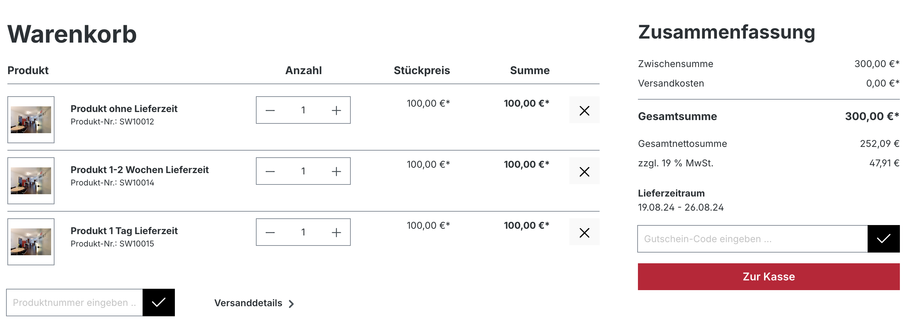

# Konfiguration

## Hinweise zur Berechnung des Lieferdatums

### Bei Angabe der Lieferzeit in Tagen

Bei der Berechnung des Lieferdatums im Checkout werden die Wochenenden (Samstag und Sonntag) nicht berücksichtigt. 
Das Lieferdatum wird also um die Anzahl der Samstag/Sonntage verlängert, die in den angegebenen Tagen enthalten sind.

**Beispiel:**

- Lieferzeit: 1-3 Tage
- Bestellung am Freitag, 16.08.2024

Lieferzeitraum

- Im Shopware-Standard: Samstag, 17.08.2024 - Montag, 19.08.2024 
- Mit Plugin: Montag, 19.08.2024 - Mittwoch, 21.08.2024

### Bei Angabe der Lieferzeit in Wochen/Monate/Jahre

Bei der Berechnung des Lieferdatums im Checkout wird nur berücksichtigt, ob Startdatum oder Enddatum auf ein Wochenende fällt. 
In diesem Fall wird das jeweilige Datum auf den darauffolgenden Montag gelegt.

!!! tip "Tage vs. Werktage"

    Wenn Sie Samstag und Sonntag ausschließen, sollten Sie die Lieferzeirangabe in **Werktage** anstatt Tage umbenennen.

    Siehe: _Einstellungen -> Shop -> Lieferzeiten_

## Optionen

| Option      | Beschreibung                          |
| ----------- | ------------------------------------ |
| **Samstag aussschließen**       | Schließt des Samstag aus der Berechnung des Lieferzeitraumes aus. |
| **Sonnag aussschließen**       | Schließt des Sonntag aus der Berechnung des Lieferzeitraumes aus. |
| **Nur eine Lieferzeit pro Bestellung**    | Im Shopware-Standard wird im Checkout das berechnete Lieferdatum pro Position ausgegeben. Mit diesder Option wird nur der späteste Lieferzeitaum für die gesamte Betellung ausgegeben - _siehe Screenshots._ |
| **Lieferzeit der Standard-Versandart verwenden**       | Ist bei einem Produkt keine Lieferzeit eingetragen, wird im Standard auch keine Angabe zur Lieferzeit auf der Produktdetailseite ausgegeben. Mit dieser Option wird in diesen Fällen die Lieferzeit der aktuellen Standard-Versandart auf der Produktdetailseite ausgegeben. Das heißt, es muss nicht für jedes Produkt eine Lieferzeit gesetzt werden. Ist aber eine gesetzt, wird wie im Standard auch diese Lieferzeit verwendet - _siehe Screenshots._   |
| **1 Tag Puffer bei Lieferzeitaum mit gleichem Datum**       | Fällt das berechnete Startdatum auf das Enddatum, wird im Shopware Standard automatisch 1 Tag Puffer zum Enddatum addiert. Dieses Verhalten kann über diese Option deaktiviert werden - damit werden auch tagesgenaue Lieferungen korrekt ausgewiesen. |

## Screenshots

**Nur eine Lieferzeit pro Bestellung**

**Lieferzeit der Standard-Versandart verwenden**

